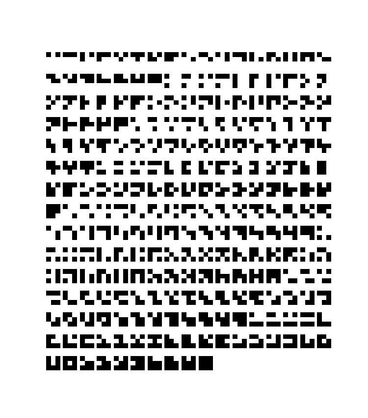
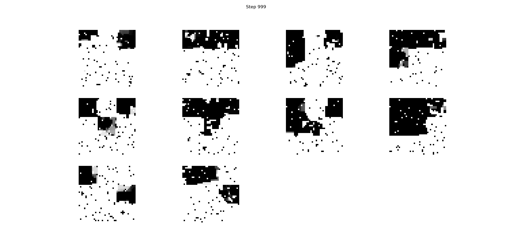

### Overall
This is a project to create a character set which is most easily distinguishable at various scales.

### Smallest-resolution characters
In `min_res` is the code to generate shift- and scale-invariant "characters" of 3 x 3 binary pixels.

I constrain the full characters to be coarse-grained to these fundamental characters, so that the characters are distinguishable at the smallest possible scale.

### Scaling to greater resolutions
In `upscale` is the in-progress code to generate highly distinct character shapes which are appropriately rasterized to their minimum-resolution versions.
I use a pretrained vision model, [dinov2](https://github.com/facebookresearch/dinov2) to embed the candidate characters, and then optimize such that:
- The embeddings are far away from each other: minimize the "energy" of the set of characters $\{c_i\}$,
$\sum_{i < j} \|\text{embed}(c_i) - \text{embed}(c_j)\|^{-1}$;
- The downscaled images have the same pattern of light and dark as the originals; and
- The images are somewhat continuous: minimize the absolute differences in adjacent pixels $\sum_i \left(\sum_{x=1}^X \sum_{y=2}^Y |(c_i)_{x,y} - (c_i)_{x,y-1}| + \sum_{x=2}^X \sum_{y=1}^Y |(c_i)_{x,y} - (c_i)_{x-1,y}|\right)$

### Results and plans
Here are the results of training only the first 10 characters according to this scheme:

These figures do have more detail than the originals, but are not especially visually distinct, and are far less figural than existing character sets.
I'm considering optimizing the parameters of a set of Bézier curves directly in order to get a result that looks more like a standard character set.